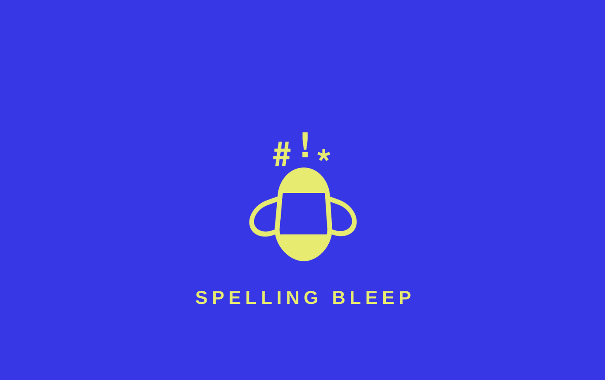
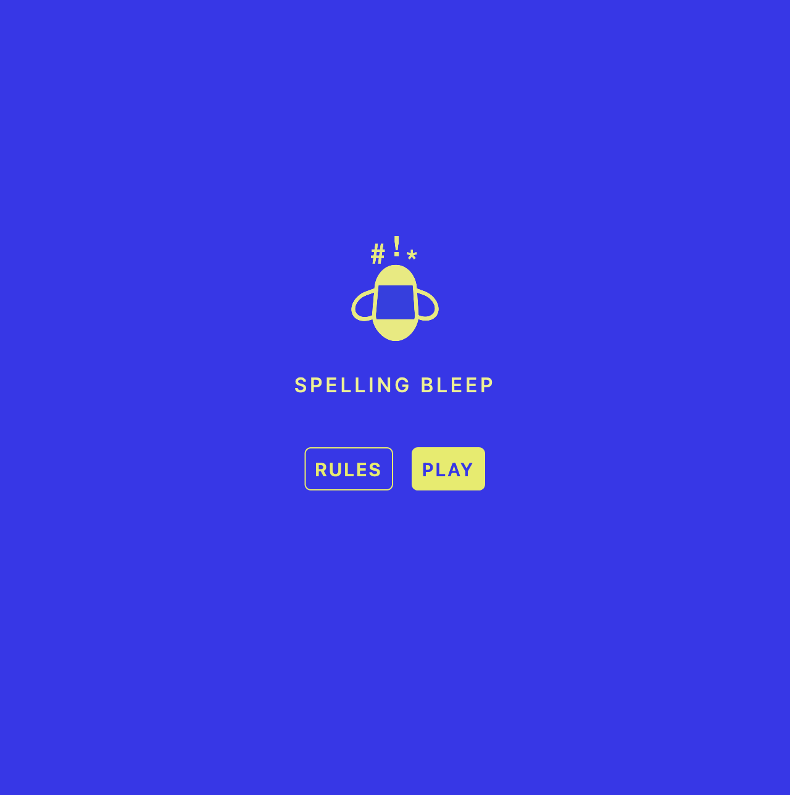
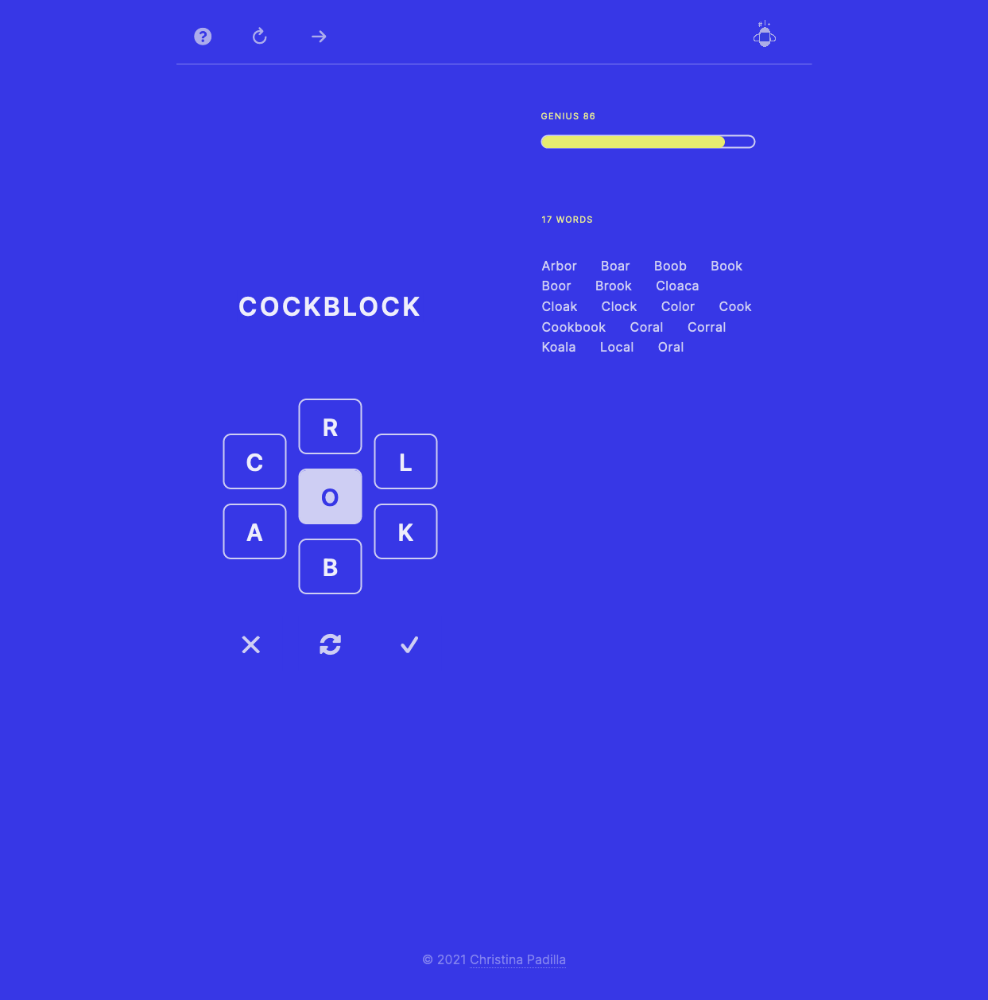

# Spelling Bleep
## Status: **Launched Feb 11, 2021**
#### [Portfolio](https://christinapadilla.com) | [GitHub](https://github.com/hipstina) | [LinkedIn](https://linkedin.com/in/hipstina)
***
## Description 

**Spelling Bleep** is my take on the popular [NYT Spelling Bee](https://www.nytimes.com/puzzles/spelling-bee) game. As many puzzlers know, the NYT deems certain words too offensive to permit in Spelling Bee. That is where **Spelling Bleep** comes in. Spelling Bleep allows and even rewards players for using lowbrow or taboo words. In Spelling Bleep, high-scoring words like 'boobies' or 'goddamn' are fair game!

The points breakdown in Spelling Bleep: 
  + 4-letter words get 1 pt 
  + words over 4 letters are awarded 1 pt per letter
  + pangrams are worth 7 extra points 
  + bleep words are worth 10 extra points
  


### Technologies Used
* HTML
* CSS
* JavaScript


### Screenshots



## Getting Started
To get started, clone this repo to your local machine.
```
git clone https://github.com/hipstina/spelling-bleep.git
```
## Future Updates
Track the progress of new features on Trello: https://trello.com/b/MvjoDecW/spelling-bleep

## Credits
+ Project inspired by the [NYT Spelling Bee](https://www.nytimes.com/puzzles/spelling-bee). It is in no way affiliated with The New York Times.
+ [This word list](https://norvig.com/ngrams/enable1.txt) by [Peter Norvig](https://norvig.com/ngrams/)
+ This [list of valid puzzle combos](https://storage.googleapis.com/spelling-bee/ls-7.txt) by [@ImJasonH](https://github.com/ImJasonH/spelling-bee) 
+ Bleep words and profanity lists from [@RobertJGabriel](https://github.com/RobertJGabriel/Google-profanity-words/blob/master/list.txt), [Frontgate Media](https://www.frontgatemedia.com/a-list-of-723-bad-words-to-blacklist-and-how-to-use-facebooks-moderation-tool/), [NoSwearing.com](https://www.noswearing.com/dictionary) and [NYTbee]([nytbee.com/](https://nytbee.com/)).
+ Will Shunn's [spelling bee F.A.Q.](https://www.shunn.net/bee/faq)
+ [@anpato](https://github.com/anpato) for helper script 
+ Color palatte from [Coolors](https://coolors.co)
+ Icons by [FontAwesome](https://fontawesome.com/v4.7.0/icons/)
+ Wireframe built with [whimsical.com](https://whimsical.com)
+ Logo built with [Figma](https://figma.com) and edited on [canva.com](https://canva.com)

## Contributing
Would you like to make Spelling Bleep better? Pull requests are welcome. For major changes, please open an issue first to discuss what you would like to change.
