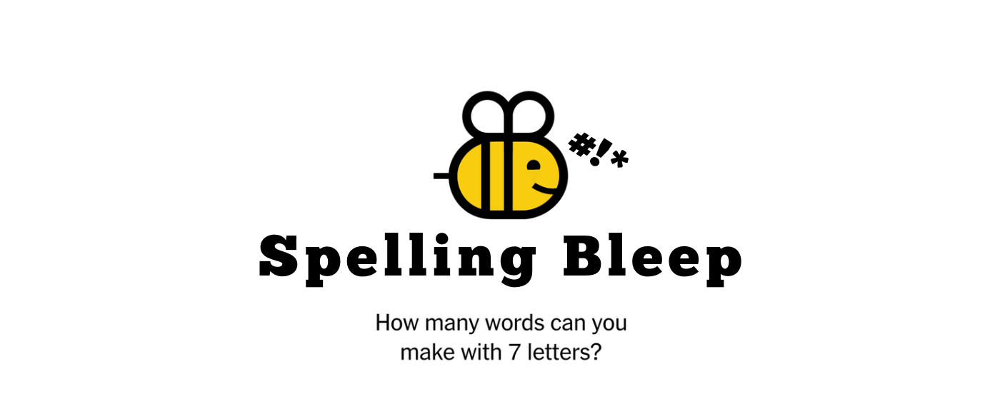

# Spelling Bleep
## Status: **In Progress**
#### [Portfolio](https://christinapadilla.com) | [GitHub](https://github.com/hipstina) | [LinkedIn](https://linkedin.com/in/hipstina)
***
### **Description** 

**Spelling Bleep** is my take on the popular [NYT Spelling Bee](https://www.nytimes.com/puzzles/spelling-bee)* game. As many puzzlers know, the NYT deems certain words too 'offensive' to permit in Spelling Bee. That is where **Spelling Bleep** comes in. Spelling Bleep allows and even rewards players for using foul language. In Spelling Bleep, high-scoring words like 'boobies' or 'goddamn' are fair game!

The points breakdown in Spelling Bleep: 
  + 4-letter words get 1 pt 
  + words over 4 letters are awarded 1 pt per letter
  + pangrams are worth 7 extra points 
  + bleep words are worth 10 extra points
  
Players only need to achieve 69% of the maximum possible points to reach genius rank. 

**The [NYT Spelling Bee](https://www.nytimes.com/puzzles/spelling-bee) is a 7-letter word puzzle. The objective of the game is to spell as many words as possible. The catch is that words must use the center letter and be at least 4 letters long.*


<caption>An example of the NYT Spelling Bee puzzle.</caption>

Track the progress of this project on Trello: https://trello.com/b/MvjoDecW/spelling-bleep


### **Technologies Used**
* HTML
* CSS
* JavaScript


### **Getting Started**
To get started, clone this repo to your local machine.
```
git clone https://github.com/hipstina/spelling-bleep.git
```


### **Screenshots**
`Coming Soon`

### **Future Updates**
`Coming Soon`

### **Credits**
+ Project inspired by the NYT Spelling Bee. It is in no way affiliated with The New York Times.
+ Wireframe built with https://whimsical.com
+ Logo edited with canva.com
